# 电商用户价值分析与精细化运营策略

> 基于 RFM 模型 + TGI 品类偏好分析，将 10,000 名用户划分为 10 个可运营客群，输出差异化策略。预估 ROI **8.2:1**。

[](https://www.python.org/)
[](https://www.mysql.com/)
[](https://powerbi.microsoft.com/)
[](https://www.docker.com/)
[](https://pandas.pydata.org/)
[](https://scipy.org/)
[](https://pytest.org/)
[](./LICENSE)

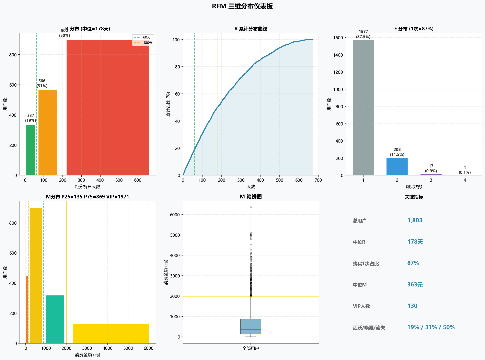

## 成果与策略

分析从 10,000 名注册用户中筛选出 1,803 名有效用户（仅 20% 订单为"已完成"状态），按最近购买时间（R）、购买频次（F）、消费金额（M）三个维度打分，切分为 19 个基础客群后合并为 10 个运营组——每组有独立的用户特征、品类偏好和触达策略。

**核心发现**：87.5% 的用户只购买过一次，说明复购率是当前最突出的短板。但同时存在一小群"至尊 VIP"（130 人，占 7.2%），人均消费 ¥2,975，仅用邮件即可获得 117:1 的 ROI——**与其花钱拉新，不如先把这批用户服务好**。另一端，有 226 人（"流失可弃"）已流失超过半年、仅消费过一次、人均才 ¥63，主动触达的 ROI 不到 0.5:1，**放弃触达反而是最优策略**。

### 总体 ROI

投入 ¥8,730 触达成本，预计激活 122 人，带来 ¥72,000 增量收入：

| 运营组 | 人数 | 响应率 | 激活 | 增量收入 | 成本 | ROI | 建议 |
|--------|------|--------|------|----------|------|-----|------|
| 至尊VIP | 130 | 23% | 30 | ¥44,600 | ¥380 | **117:1** | ✅ 全力 |
| 核心高价值忠诚 | 16 | 20% | 3 | ¥2,000 | ¥170 | **11.8:1** | ✅ 全力 |
| 高潜新客 | 59 | 18% | 11 | ¥6,700 | ¥710 | **9.4:1** | ✅ 投入 |
| 唤醒高潜 | 75 | 9% | 7 | ¥3,300 | ¥450 | **7.3:1** | ✅ 投入 |
| 活跃复购潜力 | 23 | 25% | 6 | ¥1,300 | ¥230 | **5.7:1** | ✅ 投入 |
| 流失高潜 | 64 | 8% | 5 | ¥2,000 | ¥580 | **3.4:1** | ✅ 投入 |
| 流失低潜 | 539 | 2% | 11 | ¥3,200 | ¥1,620 | **2.0:1** | ⚠️ 季度 |
| 唤醒普通 | 455 | 5% | 23 | ¥5,100 | ¥2,510 | **2.0:1** | ⚠️ 控成本 |
| 普通新客 | 216 | 12% | 26 | ¥3,800 | ¥2,080 | **1.8:1** | ⚠️ AB测试 |
| 流失可弃 | 226 | — | — | — | — | — | ❌ 放弃 |
| **合计** | **1,803** | — | **122** | **¥72,000** | **¥8,730** | **8.2:1** | — |

> 完整三档敏感性分析见 [operations/strategy.md](operations/strategy.md)

**预算效率是关键**：前 6 组（P0+P1）仅占预算的 29%，却贡献了 83% 的收入。后 4 组（P2+P3，主要是"唤醒普通"和"流失低潜"这近 1000 人）消耗了 71% 预算但回报有限——建议先对普通新客和唤醒普通做 AB 测试，验证策略有效后再放量，避免预算浪费。

### 各组策略

| 组别 | RFM 特征 | 偏好品类 | 策略 |
|------|----------|---------|------|
| **至尊VIP** | M>¥1,971, 均M=¥2,975 | Electronics(143) | 电子新品首发 + 品牌日专属折扣 + 专属客服 |
| **核心忠诚** | R<60天, F≥2, M>P75 | Groceries(186), Home(154) | 日用品订阅制引导 + 会员升级 |
| **活跃复购潜力** | R<60天, F≥2, M<P75 | Books(228), Sports(173) | 品类券 + 交叉销售（运动→运动电子） |
| **高潜新客** | R<60天, F=1, M>P75 | — | 7 天内专属跟进 + VIP 升级路径 |
| **普通新客** | R<60天, F=1, M<P75 | — | 复购提醒 + 首单满减券 + 品类教育 |
| **唤醒高潜** | R61-180天, F≥2, M>P25 | Pet Supplies(149) | 定向邮件 + 30 天限时折扣 |
| **唤醒普通** | R61-180天, F=1 / M低 | — | 最低成本纯邮件触达 + 大促通知 |
| **流失高潜** | R>180天, F≥2, M>P25 | Books(153), Beauty(150) | 邮件 + SMS 双触达 + Books/Sports 强激励 |
| **流失可弃** | R>180天, F=1, M=¥63 | — | **主动放弃** — ROI 不足 0.5:1 |
| **流失低潜** | R>180天, 其他 | — | 仅大促被动覆盖，不主动投入 |

### TGI 品类偏好：关键洞察

如果只看"哪个品类卖得最多"，答案是所有组都是 Electronics——这个结论对运营毫无帮助，因为无法区分不同客群的偏好差异。

改用 **TGI（Target Group Index）** 后，问题变成了"哪个品类在这个客群中的占比**明显高于**全体用户的平均水平"，各群差异立刻浮现：

| 运营组 | 偏好品类 | TGI | 大白话 |
|--------|---------|-----|--------|
| 至尊VIP | Electronics | 143 | 他们比其他用户更爱买电子，但**不爱**家居和运动 |
| 核心忠诚 | Groceries | 186 | 日用品是他们的复购引擎——不是电子，是柴米油盐 |
| 活跃复购潜力 | Books | 228 | 图书 TGI 高达 228（是平均水平的 2.3 倍），低价高频品类在驱动他们的复购 |
| 流失高潜 | Books | 153 | 图书偏好与"活跃复购潜力"几乎一样，但人均消费低一截（¥781 vs ¥448）——统计检验证实这两组**不是同一类用户**，不能当作"活跃复购潜力的流失版本"来处理 |
| 唤醒高潜 | Pet Supplies | 149 | 宠物用品偏好突出，沉睡前的活跃品类线索 |

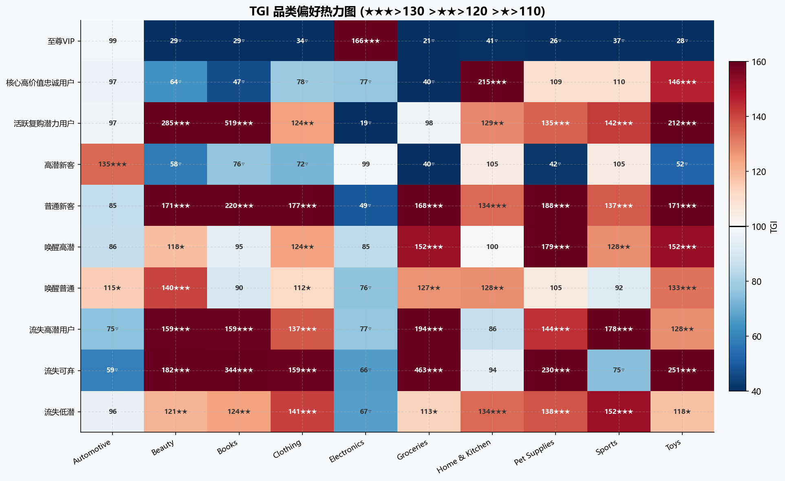

**运营启示**：推送给 VIP 的邮件应该主推电子新品，而不应该推家居折扣——他们对家居的 TGI 只有 85，低于平均水平。反之，给核心忠诚用户推 Groceries 和日用品订阅比推电子更有效。"千人千面"不是口号，TGI 数据让差异化有了依据。

## Power BI 仪表板

> 6 页交互式报告，完整 PDF：[rfm.pdf](powerbi/rfm.pdf)

| 页面 | 内容 |
|------|------|
| ① RFM 客群概览 | KPI 卡片 + 三维散点图 + 10 组分布 |
| ② 用户画像 | 性别/城市矩阵/客单价对比 |
| ③ 客群明细 | 可筛选用户列表 + R/F/M 切片器 |
| ④ TGI 品类偏好 | 热力图 + 品牌堆叠柱状图 |
| ⑤ VIP 分析 | ARPU/品类/城市/性别深度洞察 |
| ⑥ 运营落地 | 触达优先级排序 + 运营清单 |

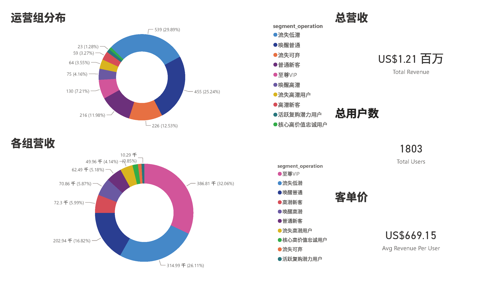
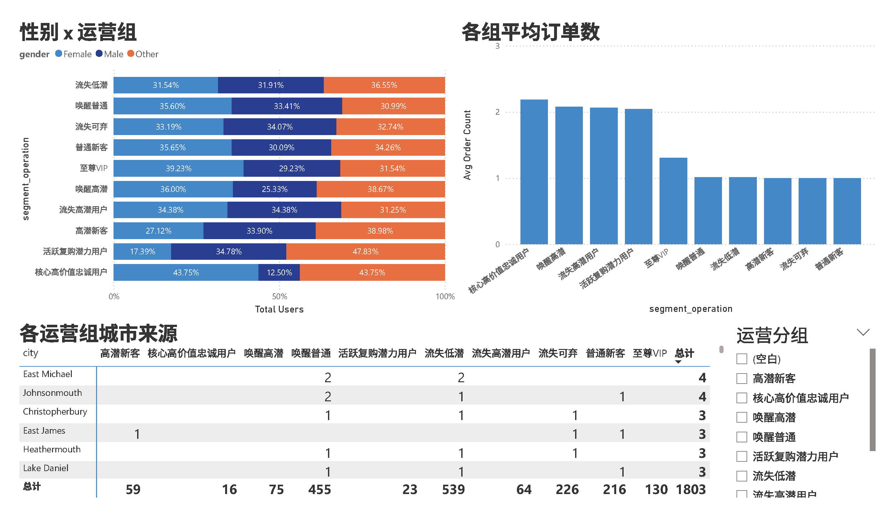
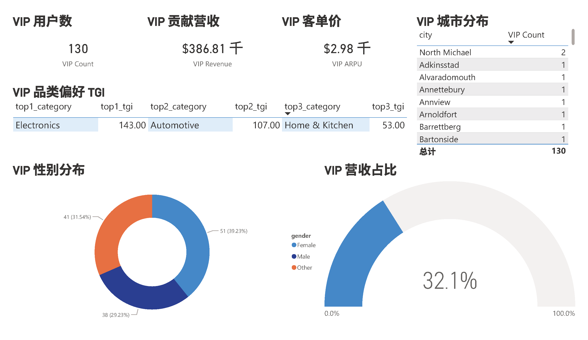
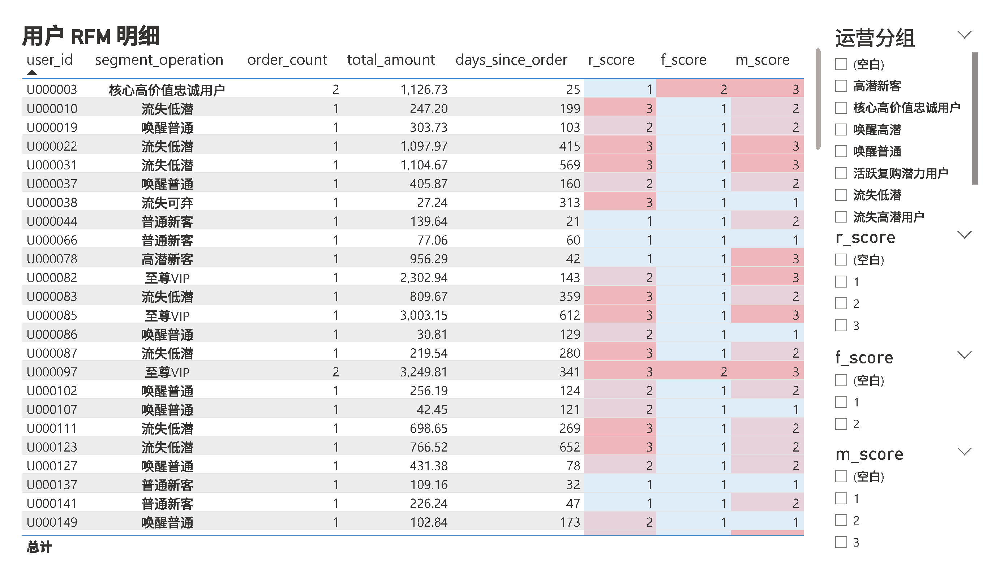
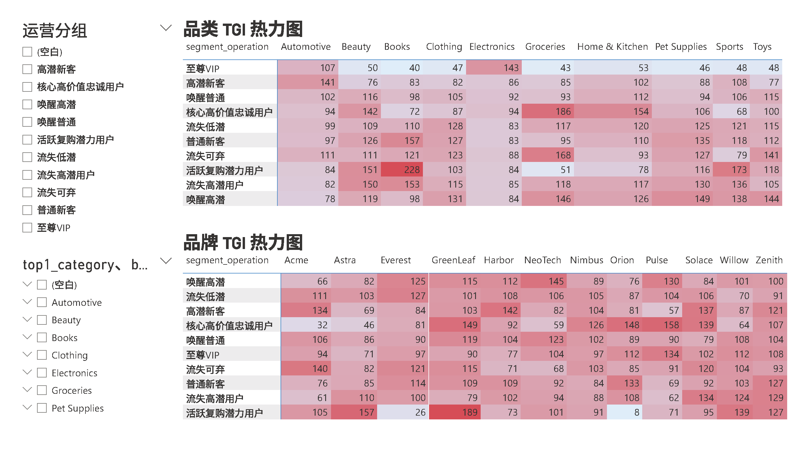
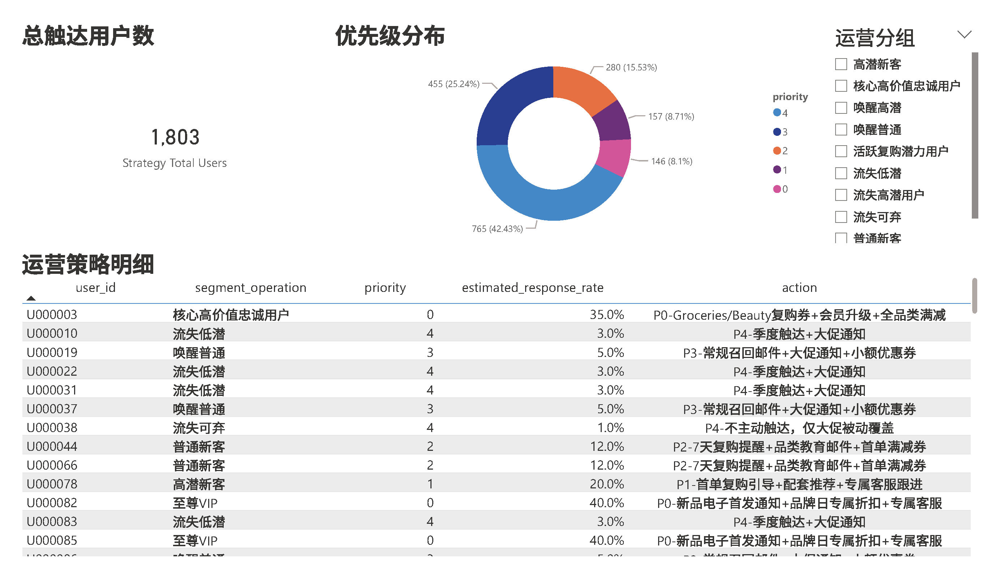

## Matplotlib 可视化

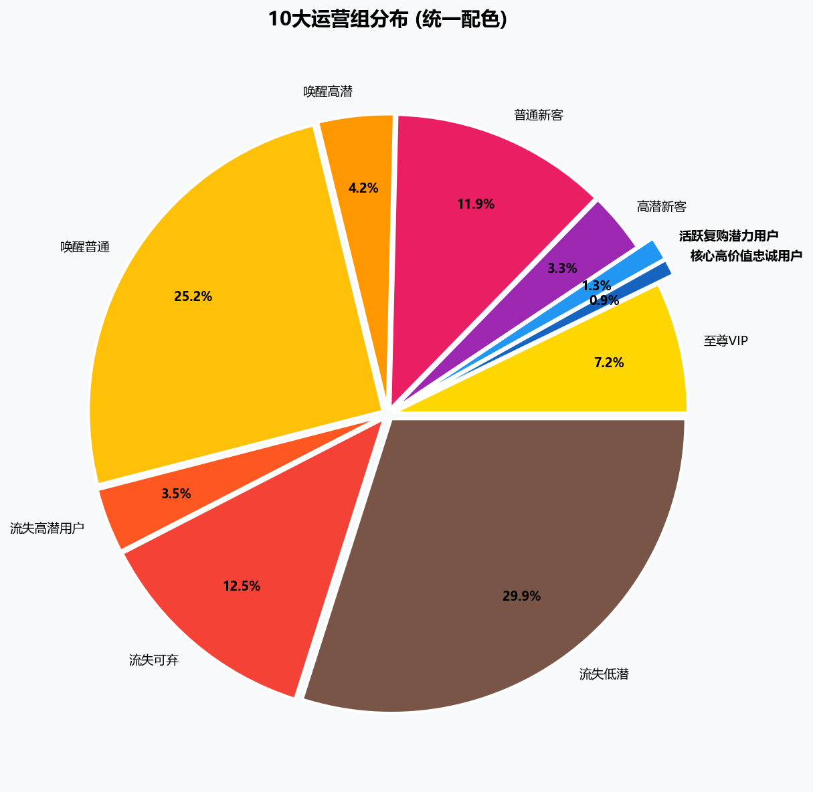
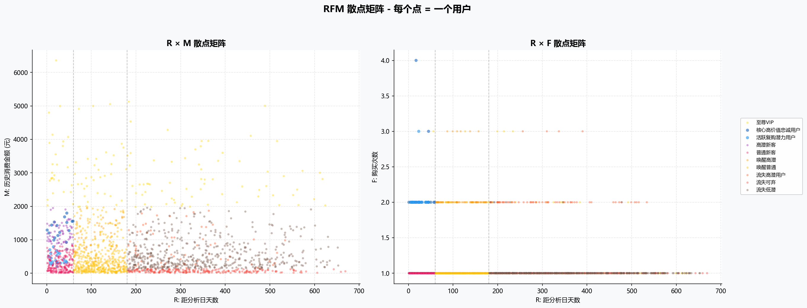
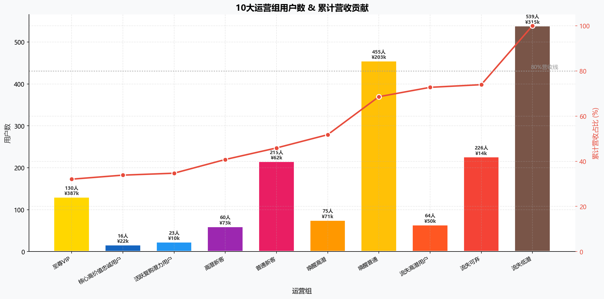
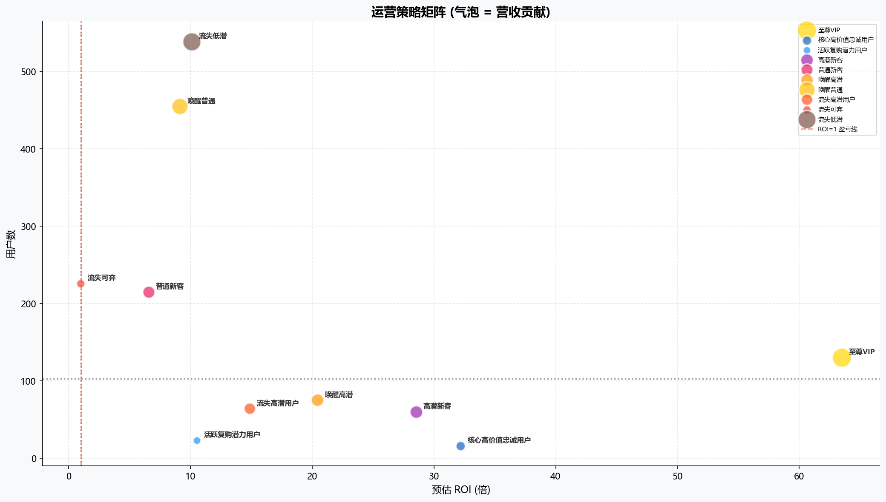

## 技能展示

| 领域 | 技能 |
|------|------|
| 数据清洗 | Pandas — 订单状态过滤、日期验证、异常值处理 |
| 统计分析 | SciPy — t检验、ANOVA、Kruskal-Wallis、Tukey HSD、Cohen's d、功效分析 |
| 用户分群 | RFM 模型 — 分位数阈值、19 类 → 10 组映射 |
| 品类分析 | TGI — 替代绝对金额排名，发掘差异化偏好 |
| ROI 预估 | 响应率乘数模型 + 三档敏感性 + 行业对标 |
| 数据建模 | MySQL 8.4 (Docker) — 星型模型、DWD/DWS 分层 |
| 可视化 | Matplotlib (8 图) + Power BI (6 页交互报告) |
| 工程化 | Docker、pytest、GitHub CI、dotenv 配置管理 |

<details>
<summary>项目结构</summary>

```
├── python/              分析脚本（6 模块）
│   ├── config.py, data_loader.py, data_cleaning.py
│   ├── rfm_analysis.py, visualization.py
│   ├── import_to_mysql.py, main.py
├── sql/                 数据库脚本（5 个）
├── powerbi/             PBIR 报表 + TMDL 模型 + PDF/PNG 导出
├── operations/          10 组策略完整文档
├── docs/                项目文档（7 份）
├── tests/               单元测试
├── previous_iteration/  V1 历史版本
└── output/charts/       8 张可视化图表
```

</details>

## 关键设计决策

| 决策 | 选择 | 理由 |
|------|------|------|
| F 分 2 档 | 1次 / 2+次 | 87.5% 用户仅购 1 次，3 档无意义 |
| M 用分位数 | P25/P75/IQR | 消除极端值，消费能力相对比较 |
| TGI 替代金额排名 | TGI > 120 | 金额反映品类结构，TGI 反映客群差异 |
| 7→10 组 | 拆分 3 个大组 | 内部差异过大，无法执行统一策略 |
| K-Means 弃用 | 规则分箱 | 聚类可解释性差，运营团队无法执行 |

## 快速开始

```bash
pip install -r requirements.txt
python python/main.py                          # 清洗 + RFM + 可视化
cp .env.example .env                           # 编辑密码
python python/import_to_mysql.py               # 导入 MySQL + Power BI 数据导出
docker exec -i mysql84 mysql ... < sql/04_category_tgi.sql   # TGI 分析
docker exec -i mysql84 mysql ... < sql/05_operational_list.sql # 运营清单
pytest tests/ -v                               # 测试
```

> 模拟数据：10,000 用户 / 20,000 订单 / 43,525 明细。分析框架适用于真实数据。

## 迭代历程

### Phase 1: V1 探索 (Apr 25–29)

对比业务规则法、分位数法、均值比较法、K-Means 四种 RFM 方案，确定分位数法。实现 **19 类 → 7 运营组**，单体脚本完成全流程。K-Means 因可解释性差被弃用。

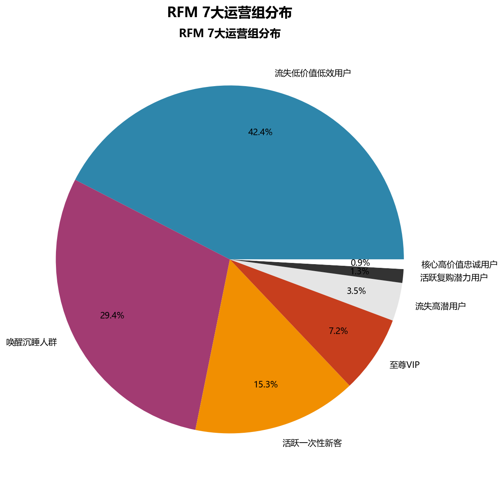

> [previous_iteration/](previous_iteration/) — V1 代码与文档

### Phase 2: 重构 (May 7)

单体脚本 → 6 模块拆分。MySQL 8.4 Docker 数据仓库，星型模型。Power BI PBIP 初始化。解决 utf8mb4 编码问题。

### Phase 3: 仪表板 (May 9)

6 页 Power BI 交互报告完成（见上方截图）。

### Phase 4: 深度优化 (May 11–12)

| 原 7 组 | → 10 组 | 原因 |
|---------|---------|------|
| 唤醒沉睡 (6类) | 唤醒高潜 + 唤醒普通 | 复购/一次性成本差 3-5× |
| 活跃新客 (3类) | 高潜新客 + 普通新客 | 高/低消费需不同首单策略 |
| 流失低效 (4类) | 流失可弃 + 流失低潜 | 中高M流失用户仍有价值 |

TGI 替代绝对金额排名解决"所有组 TOP1 都是 Electronics"的无区分度问题。统计检验增强：t检验、ANOVA (η²=0.65)、Kruskal-Wallis、Tukey HSD (39/45 对显著)。识别小样本组功效不足问题。

### Phase 5: 展示 (May 13)

文件夹整合、隐私清洗、README 优化、GitHub 发布。

## License

MIT
